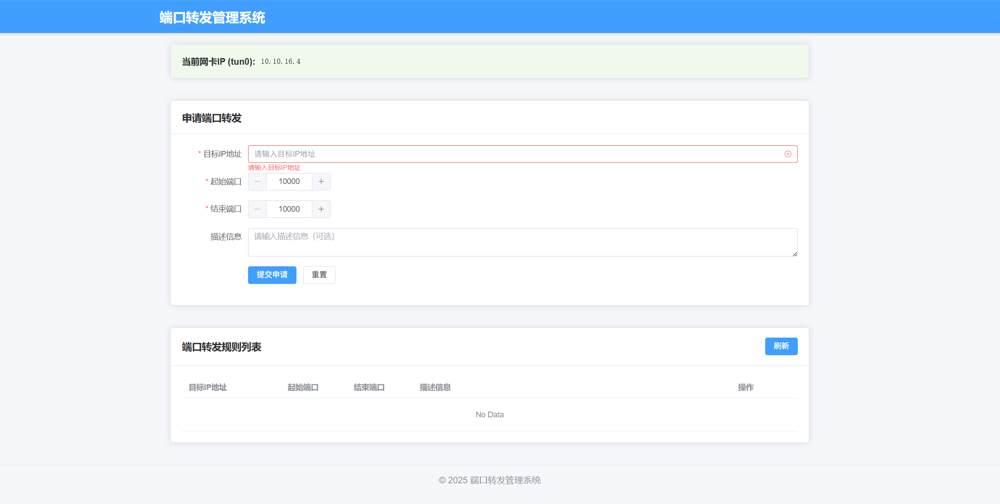

# 端口转发管理系统

这是一个用于管理端口转发规则的Web应用系统，包含前端和后端两部分。

**需求：要实现让 8 台局域网主机共享一个 OpenVPN 客户端连接到服务器，你可以通过配置 OpenVPN 客户端主机（Linux）作为网关，并启用 IP 转发和 NAT（网络地址转换）：**

**1.启用 IP 转发**

在OpenVPN客户端主机上，编辑 `/etc/sysctl.conf` 文件并启用 IP 转发：

```bash
sudo nano /etc/sysctl.conf
```

找到以下行并取消注释（如果没有这行，则添加）：

```plaintext
net.ipv4.ip_forward=1
```

使更改生效：

```bash
sudo sysctl -p
```

 **2.配置局域网主机的网关**

   在局域网中的每台主机上，将默认网关设置为OpenVPN客户端主机的本地IP地址。例如，如果OpenVPN客户端主机的本地IP为 `192.168.31.84`，则在局域网主机上设置默认网关：

```bash
sudo ip route add default via 192.168.31.84
```

   或者编辑网络配置文件来使更改在重启后依旧有效。





## 项目结构

```
├── backend/         # 后端代码
│   └── app.py      # 后端主程序
└── frontend/        # 前端代码
    ├── src/         # 源代码
    ├── index.html   # 入口HTML
    ├── package.json # 依赖配置
    └── vite.config.js # Vite配置
```

## 依赖安装

### 后端依赖

后端基于Python FastAPI框架开发，需要安装以下依赖：

```
fastapi>=0.95.0
uvicorn>=0.22.0
pydantic>=1.10.0
ipaddress>=1.0.23
```

或者创建一个`requirements.txt`文件，内容如下：

然后执行：


```bash
pip3 install -r requirements.txt
```

如果是新版本python需要创建一个和虚拟环境：

```bash
python3 -m venv .venv
source .venv/bin/activate
```


### 前端依赖

前端基于Vue 3和Element Plus开发，使用Vite作为构建工具。在`frontend`目录下执行：

```bash
npm install
```

## 启动项目

### 启动后端

在`backend`目录下执行：

```bash
python app.py
```

后端服务将在`http://localhost:8000`上运行。

### 启动前端

在`frontend`目录下执行：

```bash
npm run dev
```

前端开发服务器将启动，通常在`http://localhost:5173`上运行。

# Linux 部署生产环境

要在Linux环境中部署您的端口转发管理系统，您需要按照以下步骤操作：

1. 构建前端静态文件：
   
   - 进入frontend目录：`cd frontend`
   - 安装依赖：`npm install`
   - 构建项目：`npm run build`
   - 这将在frontend/dist目录下生成静态文件
2. 配置Nginx：
   
   - 安装Nginx：`sudo apt install nginx`
   - 创建配置文件：`sudo vim /etc/nginx/sites-available/port-manager`

```nginx
server {
    listen 80;
    server_name your_domain_or_ip; #填写自己的IP

    root /path/to/frontend/dist;#换成自己的路径，最好是/var/www/html 避免权限问题
    index index.html;

    location / {
        try_files $uri $uri/ /index.html;
    }

    location /api/ {
        proxy_pass http://localhost:8000;
        proxy_set_header Host $host;
        proxy_set_header X-Real-IP $remote_addr;
    }
}
```


3.启动

- 启用配置：`sudo ln -s /etc/nginx/sites-available/port-manager /etc/nginx/sites-enabled/`

- 测试配置：`sudo nginx -t`
- 重启Nginx：`sudo systemctl restart nginx`

确保后端服务运行：`python backend/app.py`
完成这些步骤后，您可以通过浏览器访问服务器IP或域名来使用端口转发管理系统。


## 功能说明

本系统提供以下功能：

1. 查看当前所有端口转发规则
2. 添加新的端口转发规则
3. 删除现有的端口转发规则

端口转发规则包含以下信息：
- 目标IP地址
- 起始端口（10000-65535）
- 结束端口（10000-65535）
- 描述信息（可选）

## 注意事项

- 端口范围不能超过10个端口
- 端口范围不能与现有规则重叠
- 系统使用iptables实现端口转发，需要在Linux系统上运行并具有足够的权限